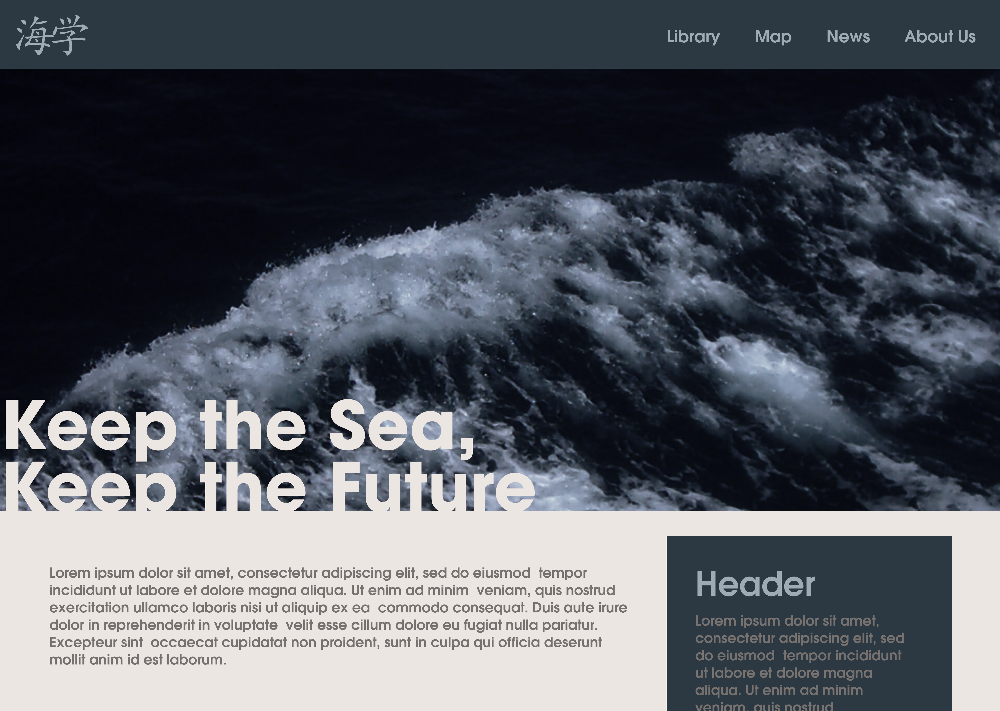
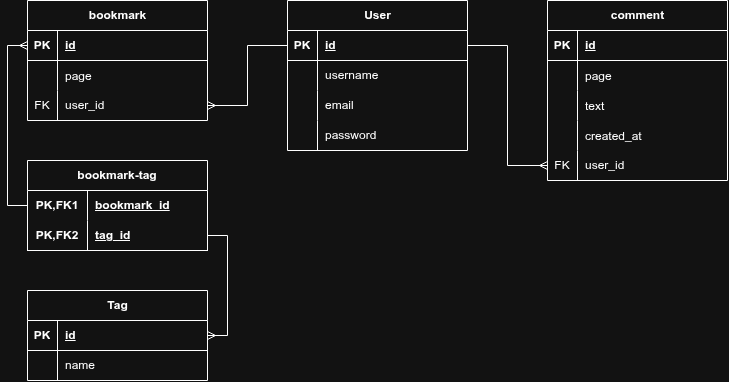

# umigaku: Raising Awareness On the Ocean and Its Conservation.

## Anggota Kelompok
 - Muhammad Athar Alfarisi (140810250005)
 - Muhammad Faiz Hariy Nugroho (140810250029)
 - Subhil Mubarak (140810250032)

## Fungsi
- Menyebarluaskan pengetahuan tentang kelautan
- Meningkatkan kesadaran untuk menjaga laut
- Menghimpun berbagai artikel tentang keindahan dan usaha pelestarian laut

## Tujuan
Projek ini diharapkan memenuhi SDG poin 4.7 dan 14.a dengan cara menjadi platform pengenalan dan edukasi tentang kelautan dan usaha konservasinya.

**SDG 4.7:** By 2030, ensure that all learners acquire the knowledge and skills needed to promote sustainable development, including, among others, through education for sustainable development and sustainable lifestyles, human rights, gender equality, promotion of a culture of peace and non-violence, global citizenship and appreciation of cultural diversity and of culture’s contribution to sustainable development

**SDG 14.a:** Increase scientific knowledge, develop research capacity and transfer marine technology, taking into account the Intergovernmental Oceanographic Commission Criteria and Guidelines on the Transfer of Marine Technology, in order to improve ocean health and to enhance the contribution of marine biodiversity to the development of developing countries, in particular small island developing States and least developed countries

## Target Pengguna
Sebanyak mungkin orang, guna meningkatkan ketertarikan dan kepedulian publik terhadap laut serta meningkatkan kesadaran akan urgensi konservasi laut dan lingkungan.

## Mockup Kasar Sederhana

## Skema Database
